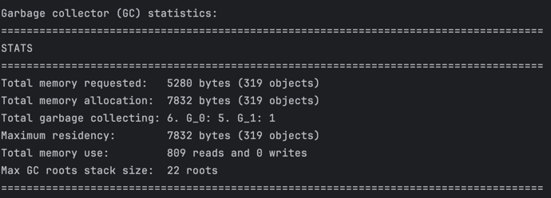
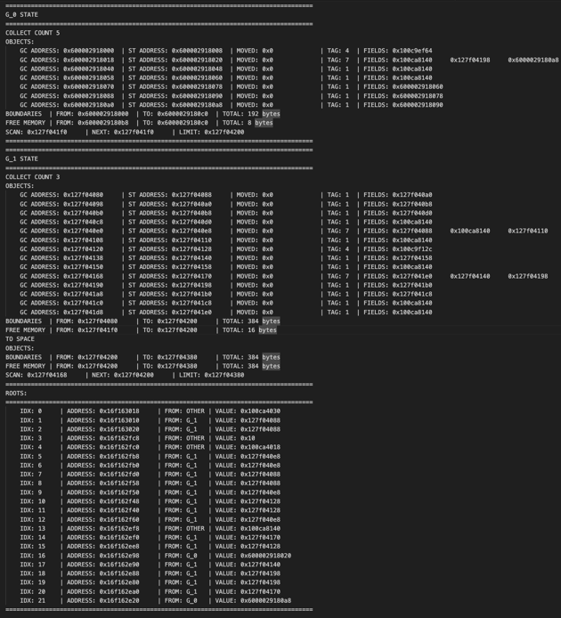

# My stella garbage collector

## Общее

Реализована копирующая сборка мусора с поддержкой сборки по поколениям (в текущей версии 2 поколения - 0 и 1).

В случае нехватки памяти осуществляется выход с кодом _**137**_ и сообщением **_Out of memory!_**

## Настройки

### DEFINE

+ **_MAX_ALLOC_SIZE_** - размер from_space для 0 поколения
+ **_GEN_SIZE_MULTIPLIER_** - множитель, во сколько раз увеличивается размер поколения
+ **_DEBUG_LOGS_** - включает пошаговае логгирование состояния GC в процессе сборки

## Запуск

Полученную программу на языке C необходимо скомпилировать вместе со средой времени исполнения и сборщиком мусора:

`gcc -std=c11 <ИМЯ>.c stella/runtime.c stella/gc.c -o <ИМЯ>`

При сборке можно указывать флаги, влияющие на отладочную печать и печать статистики
среды исполнения:
+ **_STELLA_DEBUG_** — включить отладочную печать
+ **_STELLA_GC_STATS_** — печататьстатистикуработысборщикамусорапризавершениипрограммы
+ **_STELLA_RUNTIME_STATS_** — печатать статистику работы среды времени исполнения Stella при завершении программы

+ Например, следующая команда включает все флаги:

  `gcc -std=c11 \
      -DSTELLA_DEBUG -DSTELLA_GC_STATS -DSTELLA_RUNTIME_STATS \
      <ИМЯ>.c stella/runtime.c stella/gc.c -o <ИМЯ>
`

## Примеры работы

### print_gc_alloc_stats()

1. Общее количество запрошенной памяти (в байтах и в блоках/объектах)
2. Общее количество выделенной памяти (в байтах и в блоках/объектах)
3. Общее количество сборок мусора, всего и на каждое поколение
4. Максимальное количество используемой памяти (выделенной, но ещё не собранной) всего и по каждому поколению
5. Количество чтений и записей в памяти (контролируемой сборщиком)
6. Количество срабатываний барьера на чтение/запись

### print_gc_state()

1. Состояние gc по поколению
    + Количество сборок мусора
    + Список существующих объхектов на месте
      + адрес gc объекта
      + адрес stella объекта
      + указатель на место, куда перенесли объект (на gc объект)
      + тэг
      + поля
    + Границы поколения
    + Границы свободной памяти
    + Состояние внутренних переменных для копирующей сборки мусора
2. Состояние указателей в корне
    + номер
    + указатель на элемент массива
    + принадлежность поколению
    + указатель на stella объект